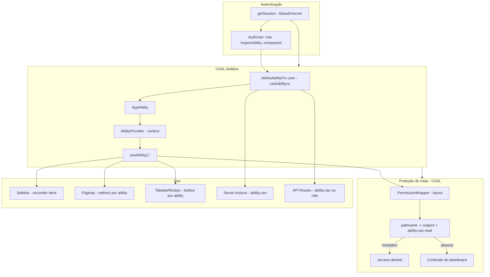

# Documentação de Permissões

Este documento descreve como as permissões estão organizadas no Inspetor Industrial, onde cada mecanismo é aplicado (rotas, API, actions, UI) e como dar manutenção (alterar regras, adicionar recursos, corrigir inconsistências).

---

## 1. Visão geral e glossário

O projeto usa **duas dimensões** de controle de acesso que funcionam em conjunto:

### Role (papel)

- **O que é:** tipo `UserRole` no Prisma: `ADMIN` | `OPERATOR` | `USER`.
- **Onde é definido:** enum em `prisma/enums/user.prisma`; campo `role` no modelo `User` em `prisma/models/user.prisma`.
- **Uso:** diversas checagens explícitas em APIs e páginas (`session.user.role === 'ADMIN'`). O acesso às rotas do dashboard é controlado apenas pelo CASL (via PermissionWrapper).

### Responsibility (responsabilidade)

- **O que é:** tipo `UserResponsibility`: `ENGINEER` | `SECRETARY` | `OPERATOR`.
- **Onde é definido:** enum em `prisma/enums/user.prisma`; campo `responsibility` no modelo `User` (default: `OPERATOR`).
- **Uso:** apenas na definição de **abilities** no CASL (`src/casl/ability.ts`): define create/read/update/delete por subject e escopo `companyId`. Não é usado na camada de rotas nem na sidebar por role.

### Subjects (CASL)

Recursos aos quais as actions se aplicam. Lista completa:

| Subject | Descrição |
|--------|-----------|
| `Company` | Empresas |
| `Client` | Clientes |
| `Storage` | Armazenamentos |
| `User` | Usuários |
| `Instruments` | Instrumentos |
| `Documents` | Documentos |
| `MaintenanceDaily` | Manutenção diária |
| `MaintenanceEquipment` | Equipamentos de manutenção |
| `ReportBoiler` | Relatórios de caldeira |
| `ReportValve` | Relatórios de válvula |
| `ReportBomb` | Relatórios de bomba |
| `all` | Todos (apenas ADMIN com `manage`) |

Uso no código: em server actions e tabelas com `subject('ReportValve', { companyId })`, `subject('Client', { companyId })`, etc., para que a condição `companyId` seja aplicada pelo CASL.

### Actions (CASL)

- `create`, `read`, `update`, `delete` — aplicáveis por subject e escopo.
- `manage` — apenas ADMIN; usado como `can('manage', 'all')`.

---

## 2. Diagrama de fluxo

Resumo do fluxo:

1. **Sessão** é obtida em server/client com `role`, `responsibility` e `companyId`.
2. **CASL**: `defineAbilityFor(user)` gera as permissões; no client o `AbilityProvider` expõe via `useAbility()` e `<Can>`.
3. **Proteção de rotas (CASL):** no layout do dashboard, o `PermissionWrapper` mapeia o `pathname` para um subject e chama `ability.can('read', subject)`. Se o usuário não tiver permissão de leitura para aquele subject, redireciona para `/access-denied`.
4. **Uso**: sidebar esconde itens por `isAdmin` ou `ability.can('read', subject)`; páginas e actions checam `ability.can` (e em vários pontos `role === 'ADMIN'`); APIs misturam role e ability.

---

## 3. Proteção de rotas do dashboard (CASL)

O controle de acesso às rotas do dashboard é feito **apenas com CASL**. Não existe mais camada separada por Role (o módulo `Permission` foi removido).

### Arquivo

- `src/app/dashboard/components/permission-wrapper.tsx`

### Semântica

- O wrapper mantém um mapeamento **prefixo de path → subject** (ex.: `/dashboard/company` → `Company`, `/dashboard/reports/boiler` → `ReportBoiler`).
- Para o `pathname` atual, é obtido o subject correspondente (se houver). Se houver subject e o usuário **não** tiver `ability.can('read', subject)`, redireciona para `/access-denied`.
- Rotas sem subject no mapa (ex.: `/dashboard`, `/dashboard/profile`) são sempre permitidas para qualquer usuário autenticado.

### Onde é usado

- `src/app/dashboard/layout.tsx`: o `AbilityProvider` envolve o `PermissionWrapper` para que o wrapper use `useAbility()`. O wrapper envolve sidebar e conteúdo.

### Mapeamento path → subject

| Prefixo do path | Subject |
|-----------------|---------|
| `/dashboard/reports/boiler` | ReportBoiler |
| `/dashboard/maintenance/equipment` | MaintenanceEquipment |
| `/dashboard/maintenance/daily` | MaintenanceDaily |
| `/dashboard/company` | Company |
| `/dashboard/storage` | Storage |
| `/dashboard/users` | User |
| `/dashboard/client` | Client |
| `/dashboard/instruments` | Instruments |
| `/dashboard/documents` | Documents |
| `/dashboard/valve` | ReportValve |
| `/dashboard/bomb` | ReportBomb |

Para adicionar nova rota protegida: incluir entrada em `PATH_SUBJECT_MAP` no `permission-wrapper.tsx` e garantir que o subject tenha a regra desejada em `src/casl/ability.ts`.

---

## 4. Camada CASL (abilities)

### Arquivo principal

- `src/casl/ability.ts`

### Regras por usuário

- **Sem role:** ability vazia (nada permitido).
- **ADMIN:** `can('manage', 'all')` — acesso total.
- **Demais roles:** dependem de `companyId` e de **responsibility**:
  - Sem `companyId` → ability vazia.
  - **OPERATOR (responsibility):** `manage` (CRUD) em `MaintenanceDaily`; `read` em `MaintenanceEquipment`. Tudo com escopo `{ companyId }`.
  - **SECRETARY:** CRUD em `Company`, `Client`, `Storage`, `User`, `Instruments`, `Documents`, `MaintenanceDaily`, `MaintenanceEquipment`; e `read`, `update`, `delete` em `ReportBoiler`, `ReportValve`, `ReportBomb`. Tudo com escopo `{ companyId }`.
  - **ENGINEER:** CRUD em todos os subjects (company-scoped + reports), com escopo `{ companyId }`.

### Condições

- Todas as permissões não-ADMIN usam condição `{ companyId }`. O `scopeConditionsMatcher` compara esse campo no objeto passado para `subject(type, { companyId })`. Assim, um usuário só pode atuar em recursos da própria empresa.

### Onde é usado

- **Layout:** `AbilityProvider` em `src/app/dashboard/layout.tsx` (contexto React).
- **Server actions:** ex. `update-valve.ts`, `create-user.ts`, `update-company.ts` — usam `defineAbilityFor(ctx.user)` e `ability.can(action, subject(type, { companyId }))`.
- **Tabelas/UI:** ex. `client/components/table.tsx`, `users/components/table.tsx` — usam `ability.can('read'|'update'|'delete', subject)` e componente `<Can I="update" a={subject}>`.
- **Sidebar:** `ability.can('read', 'Storage')`, `ability.can('read', 'Client')`, etc., para esconder itens de menu.

---

## 5. Sidebar e visibilidade

### Arquivo

- `src/components/app-sidebar.tsx` (trecho das linhas ~76–98).

### Critério por item

| Item de menu | Critério de ocultação |
|--------------|------------------------|
| Empresas (Company) | `!isAdmin` (somente ADMIN vê). |
| Usuários (Users) | `!isAdmin` (somente ADMIN vê). |
| Válvulas (Valve) | `!isAdmin` (somente ADMIN vê). |
| Bombas (Bomb) | `!isAdmin` (somente ADMIN vê). |
| Armazenamentos (Storage) | `!ability.can('read', 'Storage')`. |
| Manutenção diária (Daily) | `!ability.can('read', 'MaintenanceDaily')`. |
| Equipamentos (Equipment) | `!ability.can('read', 'MaintenanceEquipment')`. |
| Clientes (Client) | `!ability.can('read', 'Client')`. |
| Instrumentos (Instruments) | `!ability.can('read', 'Instruments')`. |
| Relatórios caldeira (ReportBoiler) | `flags.disableBoilerReport \|\| !ability.can('read', 'ReportBoiler')`. |
| Documentos (Documents) | `!ability.can('read', 'Documents')`. |

### Flags

- `disableBoilerReport`: esconde o item de relatórios de caldeira independentemente de ability.
- `disableEquipments`: desabilita a seção de equipamentos (Valve + Bomb); combinada com as ocultações por `isAdmin`, pode esconder toda a seção.

---

## 6. Proteção de páginas

Existem duas práticas no projeto:

### Por Role (somente ADMIN)

Redirect se `session.user.role !== UserRole.ADMIN`:

- `src/app/dashboard/instruments/page.tsx`
- `src/app/dashboard/bomb/page.tsx`
- `src/app/dashboard/valve/page.tsx`
- `src/app/dashboard/users/page.tsx`
- `src/app/dashboard/company/page.tsx`

Efeito: mesmo usuários com responsibility ENGINEER ou SECRETARY (que têm ability no CASL para esses subjects) não conseguem acessar essas páginas.

### Por CASL (recomendado)

Redirect se `!ability.can('read', subject)`:

- `src/app/dashboard/client/page.tsx` — `ability.can('read', 'Client')`.

### Recomendação

- Preferir **CASL** para novas páginas: `defineAbilityFor(session.user)` e `if (!ability.can('read', 'Subject')) redirect('/access-denied')`. Mantém consistência com abilities e multi-empresa.
- As páginas que hoje usam só role podem ser migradas para CASL para alinhar com a sidebar e com as server actions.

---

## 7. Server Actions e API Routes

### Server Actions

- **Padrão:** `authProcedure` → obter `ctx.user` → `defineAbilityFor(ctx.user)` → antes de alterar recurso, `ability.can(action, subject(type, { companyId }))`; em caso negativo, retornar erro/mensagem.
- **Exceções com isAdmin:** em vários casos (ex.: criar usuário em outra empresa, atribuir recurso a outra empresa), há checagem adicional `ctx.user.role === 'ADMIN'` para permitir operação cross-company.
- **authProcedure** (`src/actions/procedures/auth.ts`): valida sessão, usuário ativo, e que usuários não-ADMIN tenham `companyId` e organização válida; ADMIN pode não ter company.

### API Routes

| Rota | Controle de acesso |
|------|--------------------|
| `GET /api/users` | Apenas `UserRole.ADMIN` (403 se não for). |
| `GET /api/companies` | Apenas `UserRole.ADMIN`. |
| `GET /api/instruments` | Apenas `UserRole.ADMIN`. |
| `GET /api/valves` | Apenas `UserRole.ADMIN`. |
| `GET /api/bombs` | Apenas `UserRole.ADMIN`. |
| `GET /api/engineers` | Sessão + `ability.can('read', 'User')`; depois `isAdmin` para ampliar escopo. |
| `GET /api/clients` | Sessão + `ability.can('read', 'Client')`; depois `isAdmin` para escopo. |
| `GET /api/equipment` | Sessão + `isAdmin` para escopo. |
| `GET /api/daily-maintenance` | Sessão + `isAdmin` para escopo. |
| `GET /api/documents` | Sessão + `isAdmin` para escopo. |
| `GET /api/storages` | Sessão + `isAdmin` para escopo. |
| `GET /api/boiler-reports` | Sessão + `isAdmin` para escopo. |
| `GET /api/storage/download` | Sessão; 403 conforme regra de negócio. |

---

## 8. Sessão e dados do usuário

### AuthUser

Tipo em `src/types/auth.ts`:

- `id`, `email`, `name`, `username`, `role`, `responsibility`, `companyId`, `image`, `company` (opcional).

### Onde é preenchido

- **Server:** `getSession()` em `src/lib/auth/server.ts` — lê cookie, busca sessão e user (com `company`) no Prisma e monta `AuthUser`.
- **Client:** rotas de auth (`login`, `refresh`, `me`) devolvem `role` e `responsibility` para que o client tenha o mesmo contexto.

---

## 9. Cadastro de usuário

- **Create/Update user** hoje definem apenas **role** (e companyId, nome, email, etc.).
- **Responsibility** não aparece no formulário de usuário; usa o default do Prisma (`OPERATOR`).
- Para alterar responsibility hoje é necessário mudança direta no banco (ou adicionar campo no formulário e nas actions de create/update user no futuro).

---

## 10. Guia de manutenção

### 10.1 Adicionar um novo recurso (subject) protegido por CASL

1. **CASL:** em `src/casl/ability.ts`, adicionar o subject ao tipo `Subjects` e à constante adequada (`COMPANY_SCOPED_SUBJECTS`, `REPORT_SUBJECTS` ou `OPERATOR_READ_SUBJECTS`).
2. **Server actions:** em create/update/delete, usar `subject('NovoSubject', { companyId })` e `ability.can('create'|'update'|'delete', subject)` antes de alterar dados.
3. **UI (tabelas/modais):** usar `ability.can('read', 'NovoSubject')` e `<Can I="update" a={subject}>` onde fizer sentido.
4. **Sidebar:** adicionar item condicionado a `ability.can('read', 'NovoSubject')` e, se necessário, flag de feature.
5. **Página do recurso:** proteger com `ability.can('read', 'NovoSubject')` e redirect para `/access-denied` (padrão recomendado).
6. **API:** se houver endpoint para o recurso, checar sessão e `ability.can` (e `isAdmin` quando for listar cross-company).

### 10.2 Alterar acesso às rotas do dashboard

- O acesso às rotas é controlado só pelo CASL. Editar `src/app/dashboard/components/permission-wrapper.tsx`: o array `PATH_SUBJECT_MAP` define quais prefixos de path exigem `ability.can('read', subject)`.
- Para bloquear um path a certos perfis: o subject correspondente já deve estar restrito em `src/casl/ability.ts` (por responsibility). Para nova rota, adicionar entrada em `PATH_SUBJECT_MAP` e garantir as regras em `ability.ts`.
- Manter sincronia com a sidebar: itens de menu usam `ability.can('read', subject)` ou `isAdmin`; as rotas usam o mesmo subject no wrapper.

### 10.3 Alterar permissões por Responsibility (CASL)

- Editar `src/casl/ability.ts`: ajustar quais subjects e actions cada valor de `UserResponsibility` (OPERATOR, SECRETARY, ENGINEER) recebe.
- Manter o uso de `scope = { companyId }` para usuários não-ADMIN.

### 10.4 Adicionar nova Role ou nova Responsibility

- **Nova Role:** criar valor no enum `UserRole` em `prisma/enums/user.prisma`, rodar migração, atualizar qualquer checagem explícita de role (APIs, páginas, actions). Garantir que o tipo e a sessão incluam o novo valor. O acesso às rotas do dashboard continua sendo por CASL (ability); não há lista de rotas por role.
- **Nova Responsibility:** criar valor no enum `UserResponsibility` em `prisma/enums/user.prisma`, rodar migração; em `src/casl/ability.ts` adicionar o branch para o novo valor com os `can()` desejados; atualizar `src/mappers/user-responsability.ts` para o label. Se for editável, adicionar campo no formulário de usuário e nas actions de create/update user.

### 10.5 Inconsistências atuais (referência para correção futura)

- **Páginas só com Role:** instruments, bomb, valve, users e company redirecionam se `session.user.role !== UserRole.ADMIN`. Com isso, usuários com responsibility ENGINEER ou SECRETARY não acessam essas páginas mesmo tendo ability no CASL. Recomendação: migrar para checagem por `ability.can('read', subject)`.
- **Sidebar:** Company, Users, Valve e Bomb dependem só de `isAdmin`, enquanto o CASL concede permissões para ENGINEER/SECRETARY nesses subjects. Alinhar a sidebar às abilities (ex.: usar `ability.can('read', 'Company')`, etc.) permite consistência com as páginas e actions.

---

## 11. Arquivos-chave

| Caminho | Descrição |
|---------|-----------|
| `prisma/enums/user.prisma` | Enums `UserRole`, `UserResponsibility`, `UserStatus`. |
| `prisma/models/user.prisma` | Modelo User (role, responsibility, companyId). |
| `src/types/auth.ts` | Tipo `AuthUser` e `Session`. |
| `src/lib/auth/server.ts` | `getSession()`, montagem de `AuthUser`. |
| `src/app/dashboard/components/permission-wrapper.tsx` | Mapeamento path → subject e checagem `ability.can('read', subject)`; redireciona para `/access-denied` quando não permitido. |
| `src/casl/ability.ts` | `defineAbilityFor`, tipos `Actions`/`Subjects`, regras por role/responsibility. |
| `src/casl/context.tsx` | `AbilityProvider`, `useAbility()`, `<Can>`. |
| `src/app/dashboard/layout.tsx` | Uso de PermissionWrapper e AbilityProvider. |
| `src/components/app-sidebar.tsx` | Lógica de visibilidade dos itens de menu. |
| `src/actions/procedures/auth.ts` | `authProcedure` para server actions. |
| `src/app/access-denied/page.tsx` | Página de acesso negado. |
